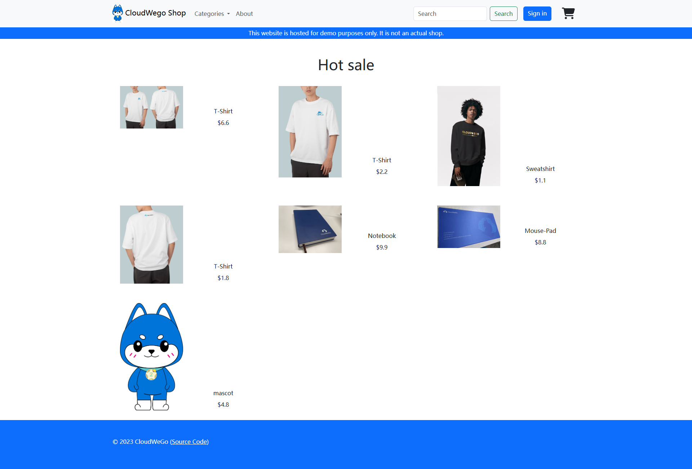
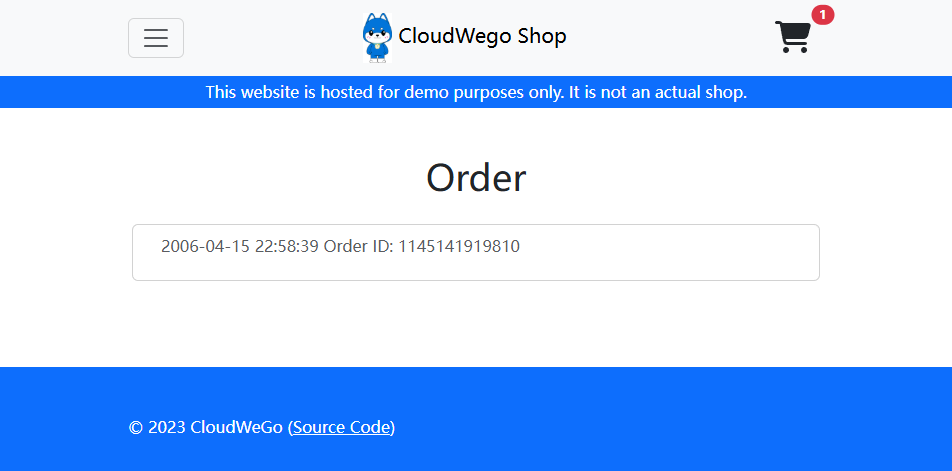

# 云原生软件技术2025秋 Lab1 小粒度模块开发与容器技术

> TA: 曹勇虎 黄秋瑞

本次Lab的主要内容如下：

- 对一个迷你型微服务系统中的两个服务进行开发
- 使用Docker容器技木将服务部署到容器中，并推送到远程镜像仓库
- 使用Docker Compose编排多个容器，实现服务的联合部署

## 1. 环境准备

在开始lab前，你需要准备/安装如下环境：

**Docker**：请参考[官方文档](https://docs.docker.com/get-docker/)安装Docker。

**Visual Studio Code**：请参考[官方文档](https://code.visualstudio.com/)安装VSCode。并在其中安装[Go插件](https://code.visualstudio.com/docs/languages/go)。

**Git**：相信大家都安装过并能熟练使用了。

**Golang 1.2x.x**：建议使用Golang版本管理工具安装。Linux/MacOS用户建议使用[goenv](https://github.com/go-nv/goenv)，Windows用户建议使用[g](https://github.com/voidint/g)。安装成功后，在命令行运行`go version`，输出类似`go version go1.21.10 windows/amd64`的信息即表示安装成功。

## 2. 运行未进行容器化的系统

准备好上述环境后，我们可以先运行未进行容器化的系统，体验一下这个系统的功能。

这个系统是一个简单的商城系统，包含了如下的微服务：

- `cart`: 购物车服务，提供了购物车的增删改查功能，位于`app/cart`目录
- `checkout`: 结账服务，提供了结账功能，位于`app/checkout`目录
- `email`: 邮件服务，提供了发送邮件的功能，位于`app/email`目录
- `order`: 订单服务，提供了订单的增删改查功能，位于`app/order`目录
- `payment`: 支付服务，提供了支付功能，位于`app/payment`目录
- `product`: 商品服务，提供了商品的增删改查功能，位于`app/product`目录
- `user`: 用户服务，提供了用户的增删改查功能，位于`app/user`目录

此外，还有一个`frontend`服务，提供了一个简单的前端页面，并将请求转发给上述的微服务。浏览器和`frontend`服务之间通过`HTTP`协议通信，`frontend`服务和微服务之间通过`gRPC`协议通信。每个微服务的`gRPC`的`proto`文件位于`idl`目录下。

### 2.1 启动中间件

该系统依赖了`consul`、`mysql`、`redis`、`nats`等中间件，分别作为服务注册中心、数据库、缓存、消息队列等。

可以使用`docker-compose`启动这些中间件。在命令行中运行：

```bash
# 进入中间件目录
cd gomall-middlewares
# 创建网络，后续容器会加入到这个网络中
docker network create gomall --driver bridge
# 启动中间件
docker-compose up -d
```

不出意外的话，你可以在Docker的管理界面里看到这些中间件的容器已经启动了。

### 2.2 编译并运行服务

以`cart`服务为例，其他服务的运行方式类似。

进入`app/cart`目录，运行如下命令以编译服务：

```bash
bash build.sh
```

服务运行时会默认读取其`cwd`下的`conf/dev/conf.yaml`文件作为配置，并会读取其`cwd`下的`.env`文件作为环境变量。因此，我们要对应地修改这两个文件，以适应我们的环境。

在之前启动中间件时，为了防止和大家电脑上已有的`MySQL`和`Redis`服务冲突，TA把`MySQL`映射到了主机的13306端口，`Redis`映射到了主机的16379端口。因此，我们需要修改`/app/cart/conf/dev/conf.yaml`和`/app/cart/.env`文件中的`MySQL`和`Redis`的配置。

修改完成后，在`app/cart`目录下运行如下命令启动服务：

```bash
bash output/bootstrap.sh
```

之后，请使用类似的方法编译并运行其他的所有服务。

如果你遇到依赖拉不下来的问题，可以尝试配置`GOPROXY`，以从国内的代理源拉取依赖。

```bash
go env -w GOPROXY=https://mirrors.aliyun.com/goproxy/
```

### 2.3 访问前端页面

访问`localhost:8080`，你会看到一个简单的商城页面。可以尝试注册、登录、添加商品到购物车、结账等操作。



### 2.4 在Visual Studio Code中运行服务（打断点）

已经帮大家写好了`.vscode/launch.json`文件，可以直接在VSCode中运行服务，并在代码中打断点。

## 3. 任务

### 3.1 将数据库中的数据映射到存储卷(或本机文件系统)以实现数据持久化

当前`gomall-middlewares/docker-compose.yml`中的`mysql`没有将数据映射到存储卷或本机文件系统，因此每次删除并重新创建数据库容器后，数据都会丢失。你的任务是修改`gomall-middlewares/docker-compose.yml`文件，将`mysql`的数据映射到存储卷或本机文件系统中，以实现数据持久化。

修改后，使用`docker compose down`命令停止并删除所有中间件容器，然后使用`docker compose up -d`命令重新启动所有容器。你应该确保之后再次删除并重新创建`mysql`容器后，数据库内的数据不会丢失。

### 3.2 开发order和checkout服务

在玩的过程中，你会发现系统中的`order`和`checkout`服务还没有实现。例如，当登录后查看订单时，返回的是一些假数据。此外，在购物车中结账时，也完全没有实现计算价格、生成订单、扣除款项等功能。



你的任务是找到`app/checkout/biz/service/checkout.go`、`app/order/biz/service/list_order.go`和`app/order/biz/service/place_order.go`等文件，实现其中标有`TODO`的部分。具体实现指导详见代码中的注释。

### 3.3 使用Docker对服务进行容器化

在完成服务的开发后，你需要将服务容器化。你需要为每个微服务编写一个`Dockerfile`文件，并使用`docker build`命令构建镜像。

在构建镜像时，你需要注意以下几点：

- 在Dockerfile中使用`golang:1.21.13-bullseye`作为基础镜像（FROM指令）
- 将源码复制（COPY指令）后，使用`bash build.sh`命令编译服务（RUN指令）
- 使用`bash output/bootstrap.sh`命令启动服务（CMD指令）
- 由于我们只在编译的时候需要源代码和编译工具，而在运行时不需要，因此有兴趣的同学可以尝试使用[多阶段构建（multi-stage build）](https://yeasy.gitbook.io/docker_practice/image/multistage-builds)来减小镜像的体积
- 由于我们构建出来的镜像可能会在不同架构（例如x86_64, arm64）的机器上运行，因此有兴趣的同学可以尝试使用[多架构构建（multi-arch build）](https://www.docker.com/blog/how-to-rapidly-build-multi-architecture-images-with-buildx/)来构建多架构的镜像
  
最终，你应该能够使用`docker run`命令启动每个服务的容器，并且这些容器应该能够正常运行。

### 3.4 将容器推送到远程镜像仓库（选做）

在完成容器化后，你可以将镜像推送到远程镜像仓库。你可以在[Docker Hub](https://hub.docker.com/)上注册一个账号，然后使用`docker login`命令登录。之后，使用`docker tag`命令给镜像打标签，再使用`docker push`命令推送到远程仓库。

如果你的网络条件无法访问Docker Hub，你可以使用[阿里云容器镜像服务](https://www.aliyun.com/product/acr)或[腾讯云容器镜像服务](https://cloud.tencent.com/product/tcr)。你可以注册一个账号，并将镜像推送到这些服务上。

如果你做了这一步，请在实验文档中说明你推送到了哪个镜像仓库，镜像的名称，以及如何拉取这个镜像。

### 3.5 使用Docker Compose编排多个容器

在完成容器化后，你需要使用Docker Compose编排多个容器，实现服务的联合部署。你需要编写一个`docker-compose.yml`文件，定义多个服务的容器，以及它们之间的网络、依赖关系等。

以下是编写`docker-compose.yml`文件的一些提示与建议：

- 可以将每个服务的容器连接到[2.1](#21-启动中间件)节创建的`gomall`网络中，这样各个容器间就可以通过`<容器名:ip>`的方式相互访问
- 可以使用`depends_on`字段来定义容器间的依赖关系，例如`frontend`服务依赖于`cart`、`checkout`等服务
- 可以使用`ports`字段来定义端口映射，例如将`frontend`服务的8080端口映射到主机的8080端口
- 可以使用`environment`字段来定义环境变量，例如`MYSQL_HOST`、`REDIS_HOST`等，以替代在容器外运行时的`.env`文件
- 可以通过`volume`字段将宿主机的目录映射到容器中，例如将每个服务的配置文件映射到容器中等

最终，你的`docker-compose.yml`文件应该能够通过`docker-compose up`命令启动所有的服务（不需要包含中间件），并且`gomall`系统应该能完全正常运行。

## 4. 评分标准

本次Lab的评分标准如下：

| 评估项                                      | 权重 |
| ------------------------------------------- | ---- |
| MySQL数据持久化是否成功                     | 5%   |
| order和checkout服务的功能正确性，代码质量等 | 25%  |
| 服务的容器化是否成功，容器的运行是否正常    | 30%  |
| 是否成功推送到远程镜像仓库                  | 10%  |
| Docker Compose编排的正确性                  | 20%  |
| 实验报告                                    | 10%  |


## 5. 提交

请将整个目录打包成`zip`文件，命名为`gomall-<小组编号>.zip`，并提交到Elearning上。提交的内容需至少包含：

- 修改后的`gomall-middlewares/docker-compose.yml`文件
- 每个服务的源代码，及对应的`Dockerfile`文件
- 你推送到远程镜像仓库的镜像名称（如果做了3.4）
- 用来编排多个容器的`docker-compose.yml`文件
- 一份**简短**的实验报告，简要说明你们小组的实践内容和过程，并附上组员的分工情况
  

助教已经在Elearning上把大家分成了小组，因此只要小组内的一个人提交即可。

**截止时间：2025年11月2日23:59**
